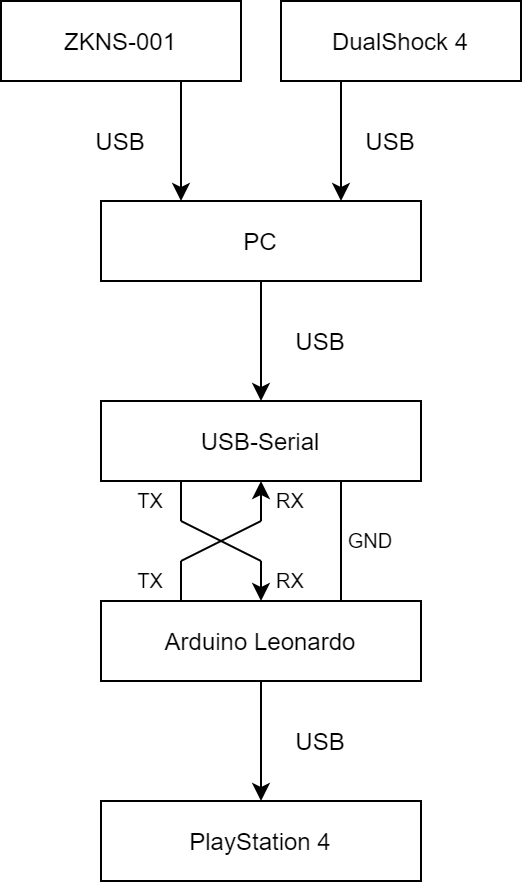

GIMX Config for Train
=====

“電車でGO!!専用ワンハンドルコントローラー for Nintendo Switch” (以下 ZKNS-001) を GIMX Adapter で変換し、PlayStation 4 版 “電車でGO!!はしろう山手線” で使用するための設定ファイルです。

**株式会社瑞起 様・株式会社スクウェア・エニックス 様への当設定に関するお問い合わせはご遠慮ください。**

## 設定ファイル

- `windows`
  - GIMX Launcher を Windows で動作させる場合の設定ファイルです。
- `raspberrypi`
  - GIMX Launcher を Raspberry Pi で動作させる場合の設定ファイルです。
- `ZKNS-001.xml`
  - 103系以外のすべての車両に使用します (ブレーキ8段+マスコン5段)
- `ZKNS-001-103-Series.xml`
  - 103系に使用します (ブレーキ4段+マスコン4段)

## 用意するもの

- GIMX Adapter
  - Arduino Leonardo または ATmega32u4 を搭載した互換ボード
  - USB-シリアル変換モジュール
- DualShock 4

## GIMX Adapter の制作

[Game Arena 様の Web ページ](https://gamearena.blog.jp/archives/461530.html) を参考に GIMX Adapter を制作します。

GIMX のファームウェアは `EMUPS4` を選択します。

**Game Arena 様への当設定に関するお問い合わせはご遠慮ください。**

## GIMX Adapter の接続

ZKNS-001、DualShock 4、USBシリアル変換モジュール、Arduino Leonardo、PS4 を以下の通りに接続します。



## 設定ファイルの配置

### Windows の場合

`C:\Users\ユーザー名\AppData\Roaming\gimx\config` を開き、`ZKNS-001.xml` と `ZKNS-001-103-Series.xml` をコピーします。

### Raspberry Pi の場合

`~/.gimx/config` を開き、`ZKNS-001.xml` と `ZKNS-001-103-Series.xml` をコピーします。

## GIMX Launcher の起動

### Windows の場合

GIMX Launcher を起動し、Config から `ZKNS-001.xml` または `ZKNS-001-103-Series.xml` を選択します。

Start を選択するとターミナルが起動します。

```
Press the key/button assigned to PS.
```

というメッセージが表示されたら、**ZKNS-001 の Home ボタン** を押します。正しく接続されていれば PS4 がコントローラ選択画面に移行します。

### Raspberry Pi の場合

```shell
gimx -c ZKNS-001.xml -p /dev/ttyUSB0
```

を実行します。

```
Press the key/button assigned to PS.
```

というメッセージが表示されたら、**ZKNS-001 の Home ボタン** を押します。正しく接続されていれば PS4 がコントローラ選択画面に移行します。